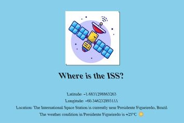

# Where is the ISS?

This project provides real-time information about the International Space Station (ISS) location and weather conditions at its current position.

## Description

This web application fetches data from two APIs to display the current latitude and longitude of the ISS along with its location and nearby weather conditions.

## Features

- Displays the latitude and longitude coordinates of the ISS.
- Determines the location of the ISS using reverse geocoding.
- Retrieves weather conditions of the ISS location using the `wttr.in` API.

## Preview

## How to Use

1. Clone this repository.
2. Open `index.html` in a web browser.
3. The webpage will display the current latitude and longitude of the ISS along with its location and weather conditions.

## Credits

- **ISS Location Data**: [wheretheiss.at](https://wheretheiss.at/)
- **Reverse Geocoding**: [BigDataCloud](https://www.bigdatacloud.com/)
- **Weather Information**: [wttr.in](https://github.com/chubin/wttr.in)

## License

This project is licensed under the MIT License - see the [LICENSE](LICENSE) file for details.
